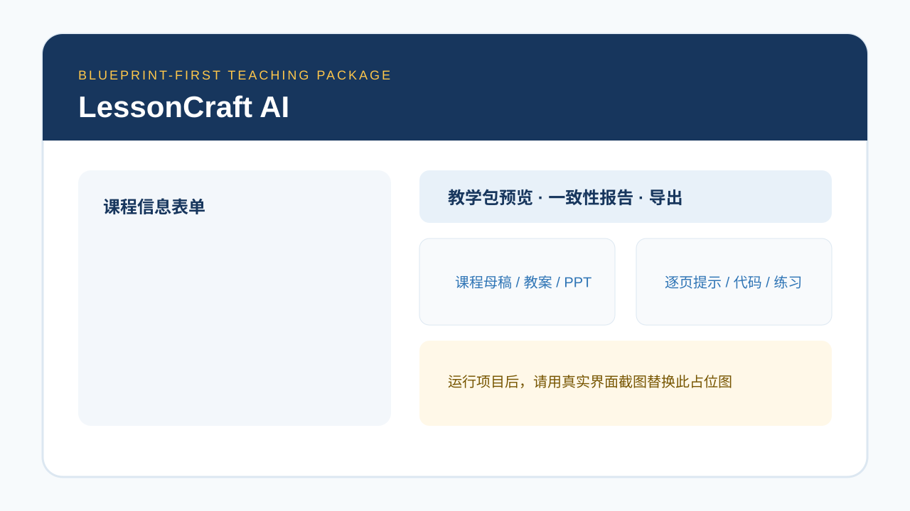
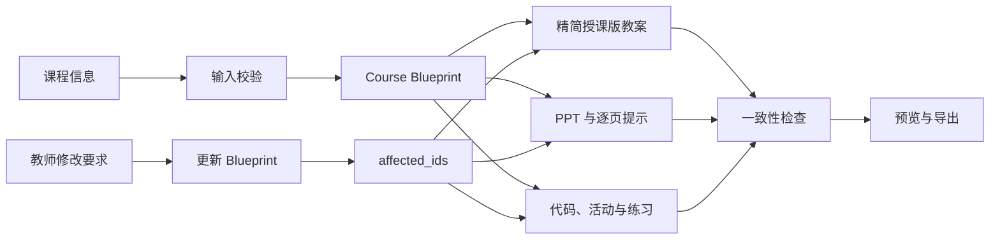

# LessonCraft AI

**少儿编程教学包生成 Skill**

输入课程主题、学生年龄、已有基础和课时时长，自动生成内容一致的教案、PPT
课件、教师逐页讲解提示、示例代码和练习题。

> 该项目不是大型在线教育平台，而是一个以课程内容生成和一致性控制为核心的
> AI Skill MVP。它优先验证“老师是否愿意使用与付费”，不包含账户、支付、数据库
> 或复杂后台。

## 1. 项目介绍

LessonCraft AI 面向少儿编程机构老师、独立教师和新手教师。它用一个统一的
`CourseBlueprint` 管理课程事实，再从 Blueprint 派生所有交付物，避免模型分别生成
教案和 PPT 后出现目标、术语、顺序、代码不一致。

仓库内置 Demo Mode。克隆后即使没有 API Key，也可以查看完整教学包并导出 PPTX、
DOCX、JSON 和示例代码。

## 2. 产品截图



> 上图是仓库占位图。发布作品集前，建议用真实 Streamlit 首页与结果页截图替换。

## 3. 解决的问题

- 备课素材散落：教案、课件、代码和练习通常需要分别制作。
- 内容互相打架：PPT 临时增加知识点，教案目标与练习又无法对应。
- 新手教师难上手：模型给出“看起来完整”的内容，却缺少课堂动作和时间控制。
- 修改成本高：改一个目标后，老师需要手动同步多份文件。
- 生成结果难交付：聊天文本不能直接成为可编辑、可打印的教学资料。

## 4. 核心功能

- 统一课程母稿：所有内容只从 `CourseBlueprint` 派生。
- 职责清晰的教学包：精简授课教案负责导航，学生 PPT 负责课堂推进，逐页提示负责教师讲解。
- 课堂节奏课件：问题、预测、代码拆解、调试和动手任务交替出现，不再是文字大纲。
- 来源追踪：目标、知识点、环节、代码、活动和练习都使用稳定 ID。
- 双层一致性检查：本地确定性规则是硬门槛，真实模型模式再做只读语义复核。
- Blueprint-first 修改：先更新母稿并返回 `affected_ids`，再重建派生内容。
- 编辑与导出：生成 16:9 PPTX、可打印 DOCX、完整 JSON 和示例代码。
- 无密钥演示：固定“Python 猜数字游戏”样例不调用任何模型 API。

## 5. Skill Workflow



系统不伪装成多个自主 Agent。页面只展示真实的顺序进度：分析需求、生成母稿、
生成教案、生成 PPT、检查一致性、完成。

## 6. Course Blueprint 架构

`CourseBlueprint` 是唯一事实来源（Single Source of Truth）：

```text
CourseBlueprint
├── course                 课程基本信息、时长、页数上限
├── knowledge_scope        required / mentioned_only / excluded 教学边界
├── terminology            标准术语与统一定义
├── learning_objectives    可观察、可评估目标（OBJ-*）
├── knowledge_points       知识点与常见错误（K-*）
├── lesson_flow            有序课堂流程（STEP-*）
├── code_examples          不可被派生内容改写的代码（CODE-*）
├── activities             课堂活动（ACT-*）
└── exercises              练习与答案（EX-*）
```

教案每个阶段保留 `step_id`、`objective_ids`、`knowledge_ids` 和真实
`slide_ids`。PPT 每页保留 `source_step_ids`、目标、知识点与可选
`code_example_id`，并用简洁的 `slide_type`、`learning_action`、`interaction`
和 `code_display` 描述课堂行为。代码页只引用 Blueprint 原始代码，不再自行生成
另一个版本。

每个 `STEP-*` 同时保留兼容字段 `duration_minutes` 和结构化时间：

```json
{
  "total_minutes": 20,
  "presentation_minutes": 7,
  "student_practice_minutes": 12,
  "transition_minutes": 1
}
```

教案显示 `total_minutes`，它包含投屏讲解、学生操作、教师巡视和过渡；PPT 备注中的
“时间建议”只表示该页实际投屏讲解时间。同一 STEP 所有 PPT 页的备注时间不会超过
`presentation_minutes`。

本地检查覆盖：

- 教学目标与知识点覆盖
- 教学顺序和总时长
- 术语出现情况
- 代码引用一致性
- 教案与 PPT 映射
- 练习与目标映射
- PPT/教案是否引用 Blueprint 外 ID
- 每四页内是否有课堂互动、是否连续纯文字
- 单页信息量、教案字段长度与逐页提示长度
- 教案流程表页码是否与 PPT 实际来源页一致
- required / excluded 知识范围
- 结构化学生操作与 forbidden_actions
- STEP 子时间、课程总时间和 PPT 讲解预算
- 活动、代码与实际 slide_ids 绑定
- Slide 目标是否为来源 STEP 目标的子集
- 练习 delivery_mode 与学生 PPT 展示方式

## 7. 技术栈

- Python 3.11+
- Streamlit
- Pydantic v2
- OpenAI Python SDK（兼容 OpenAI-style API）
- python-pptx
- python-docx
- python-dotenv
- pytest

## 8. 项目目录

```text
lessoncraft-ai/
├── app.py
├── SKILL.md
├── README.md
├── requirements.txt
├── .env.example
├── prompts/               5 组独立 Prompt
├── models/                Pydantic 数据模型
├── services/              LLM、生成、检查、修改流程
├── exporters/             PPTX / DOCX 导出
├── utils/                 JSON、校验、文件工具
├── scripts/               演示产物再生成脚本
├── templates/             后续品牌模板入口
├── examples/
│   ├── sample_input.json
│   └── sample_output/     固定 Blueprint 与可打开的演示产物
├── tests/                 20 个离线测试
└── output/                本地输出目录
```

## 9. 安装步骤

```bash
python -m venv .venv
source .venv/bin/activate
pip install -r requirements.txt
cp .env.example .env
```

Windows PowerShell 激活命令：

```powershell
.venv\Scripts\Activate.ps1
```

## 10. 环境变量配置

编辑 `.env`：

```env
LLM_API_KEY=你的密钥
LLM_BASE_URL=服务商提供的兼容 API 地址
LLM_MODEL=服务商提供的模型名称
```

- OpenAI：填写 OpenAI API Key、兼容 Base URL 与可用模型名。
- DeepSeek：填写 DeepSeek 提供的 Key、兼容 Base URL 与模型名。
- 其他服务：只要实现兼容的 Chat Completions 接口即可。
- 不要提交 `.env`；仓库已经通过 `.gitignore` 排除它。

当 `LLM_API_KEY` 或 `LLM_MODEL` 缺失时，页面默认启用 Demo Mode 并给出明确提示。

## 11. 启动方法

```bash
streamlit run app.py
```

浏览器打开 Streamlit 提供的本地地址。第一次体验建议保持 Demo Mode 开启，点击
“生成完整教学包”，随后查看 7 个预览 Tab 和 4 个下载按钮。

## 12. 示例输入

```json
{
  "language": "Python",
  "topic": "猜数字游戏",
  "age_range": "10～12 岁",
  "student_level": "学过变量、input 和 if",
  "duration_minutes": 90,
  "core_goal": "理解并使用 while 循环",
  "teaching_style": "互动实践型",
  "max_slides": 15,
  "additional_requirements": "课堂最后完成一个完整小游戏"
}
```

完整文件见 [`examples/sample_input.json`](examples/sample_input.json)。

## 13. 示例输出

固定演示输出位于 [`examples/sample_output/`](examples/sample_output/)：

- `blueprint.json`：唯一事实源
- `lesson_plan.json`：自动绑定真实 PPT 页码的精简教案数据
- `slide_deck.json`：包含 step_bindings、活动、练习与来源 ID 的课件数据
- `consistency_report.json`：核心事实与授课执行层的结构化检查结果
- `teaching_package.json`：完整结构化教学包
- `guess-number-lesson-plan.docx`：3～5 页目标的精简授课版教案，流程表为核心
- `guess-number-slides.pptx`：16:9 学生课件，包含多种课堂布局，逐页提示写入备注
- `guess_number_examples.py`：可运行示例代码

需要重建这些样例时：

```bash
python scripts/generate_demo_assets.py
```

## 14. 测试方法

测试不会调用真实或付费模型 API：

```bash
pytest
python -m compileall .
```

当前覆盖：

1. 输入模型校验
2. Blueprint ID 格式与跨引用
3. 教学时长总和
4. 目标覆盖
5. PPT 引用不存在知识点
6. 教案与 PPT 代码引用
7. PPTX 成功生成并可重新打开
8. DOCX 成功生成并可重新打开
9. PPT 布局与页面类型多样性
10. 每四页内至少一次互动、单页信息量限制
11. 代码展示只引用 Blueprint
12. 精简教案流程字段、PPT 页码和去重复规则
13. 逐页讲解提示长度与结构

## 15. MVP 边界

第一版明确不做：

- 登录、注册、会员与支付
- 数据库、多租户和复杂管理后台
- RAG 知识库
- 微服务和集群部署
- 复杂多 Agent 自主循环
- Next.js 前后端分离
- 高复杂度 PPT 动画与品牌模板市场

当前修改流程为安全优先：根据 `affected_ids` 更新 Blueprint 后，重新生成体量很小的
派生教案和 PPT。后续有真实性能需求时，再做段落级增量生成。

## 16. 后续规划

- 让 5～10 位真实老师用自己的课程主题完成一次备课。
- 增加 Blueprint 可视化编辑器，而不是让老师直接修改 JSON。
- 增加 Scratch 积木截图与 `.sb3` 交付策略。
- 增加机构品牌 PPTX/DOCX 模板。
- 保存人工修改差异，评估哪些字段最常被教师调整。
- 在真实反馈证明需要后，再做局部增量生成与更多课程类型。

## 17. 商业验证思路

7 天内只验证一个核心问题：**老师是否愿意为了“省下备课时间且内容一致”持续使用？**

建议流程：

1. 找 5～10 位 Scratch、Python 或 C++ 教师。
2. 每位教师使用自己的下周课程生成一次教学包。
3. 记录从输入到可上课版本的总时间、手动修改次数和修改字段。
4. 课后询问：是否真的使用、哪部分最有价值、若每月生成 10 节课愿付多少钱。
5. 只有出现重复使用与明确付费信号，再决定模板、协作或账户能力。

最重要的指标不是生成次数，而是“生成后真实上课的教学包数量”。

## 已知限制

- 模型输出质量仍取决于所选兼容 API；Pydantic 与重试能保证结构，不能保证所有教学判断。
- 本地检查擅长 ID、覆盖和顺序；真实模型模式额外做语义审查，但教师仍应在上课前复核。
- `python-pptx` 对备注写入的支持受版本影响；当前依赖版本会写入 PPT 备注，同时
  Streamlit 的“教师逐页讲解提示”Tab 可独立查看。为保持教案精简，DOCX 不再重复
  全部逐页提示。
- Demo Mode 的自然语言修改是确定性演示，只直接识别时长和两种教学风格，其余要求会作为
  `revision_notes` 记录并触发派生内容重建。
- 第一版 PPT 支持 title、section、question、concept、code、activity、comparison、
  summary、assignment 基础布局，不包含复杂动画、机构品牌资产或自动配图。

## License

[MIT](LICENSE)
